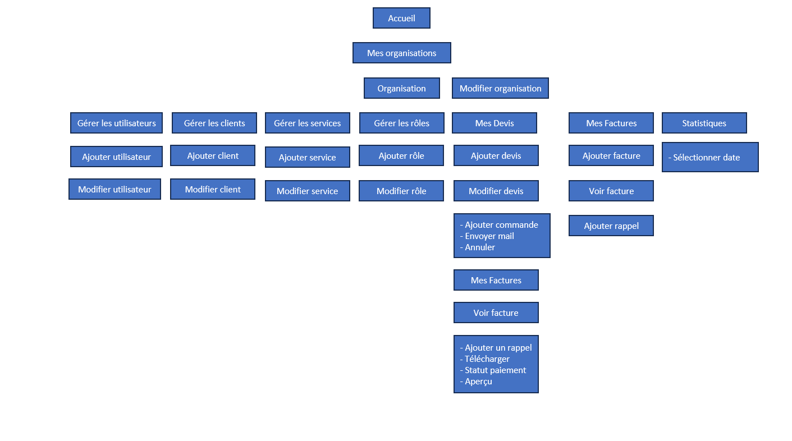

<h2 align="center">
  <a href="https://billy.campani.fr/" alt="billy url">Billy Project <br/> Invoicing Software for Small Business Events</a>
</h2>
<div align="center">
 
</div>

## Objectif Principal

Le projet Billy vise à développer une application SaaS (Software as a Service) de facturation pour répondre aux besoins spécifiques des petites entreprises opérant dans le secteur de l'événementiel. L'objectif est de fournir une solution logicielle intuitive, conforme à la législation en vigueur, et facile à utiliser pour simplifier la gestion des devis, des factures et des services.

## Caractéristiques Principales

-   **Simplification de la Gestion des Services et Descriptions:** Le logiciel doit permettre aux utilisateurs de créer facilement des devis et des factures en incluant des descriptions détaillées des services fournis lors d'événements.

## Objectifs

1. **Respect des Législations:** Assurer que le logiciel est conforme aux réglementations financières et fiscales en vigueur pour garantir la légalité des transactions effectuées.

2. **Facilité d'Utilisation:** Concevoir une interface conviviale et intuitive qui permet aux utilisateurs, même sans formation approfondie en comptabilité, de naviguer facilement à travers les fonctionnalités du logiciel.

3. **Simplicité:** Simplifier les processus de facturation pour minimiser le temps et les efforts nécessaires à la création et à la gestion des devis et des factures.

## Segment de Clients

Le logiciel de facturation Billy cible principalement les petites entreprises opérant dans le domaine de l'événementiel. Ces entreprises peuvent être des auto-entrepreneurs ou des PME et peuvent avoir ou non des comptables permanents. Les principaux segments clients comprennent:

1. **Auto-Entrepreneurs Événementiels:** Les professionnels travaillant de manière indépendante dans l'organisation d'événements, tels que les planificateurs d'événements, les photographes événementiels, etc.

2. **PME Événementielles:** Les petites et moyennes entreprises spécialisées dans la planification, la gestion ou la fourniture de services pour des événements, tels que les agences événementielles, les services de traiteur, les entreprises de location de matériel, etc.

3. **Entreprises Événementielles sans Comptables Fixes:** Les entreprises qui n'ont pas de comptables internes dédiés et qui ont besoin d'une solution simple et automatisée pour gérer leur facturation et leurs finances.

## Build With

-   [Node.js](https://nodejs.org/en/)
-   [PHP](https://www.php.net/)
-   [PostgreSQL](https://www.postgresql.org/)
-   [Symfony](https://symfony.com/)
-   [Docker](https://www.docker.com/)

## Installation

Clone the repository

```bash
git clone https://github.com/ZeRiix/Billy.git && cd Billy
```

Start the container

```bash
docker-compose up -d
```

## Contributors

-   [ZeRiix](https://github.com/ZeRiix) 
-   [Maubry94](https://github.com/Maubry94) 
-   [Vitaalx](https://github.com/Vitaalx) 
-   [mathcovax](https://github.com/mathcovax) 

## Features

-   [x] Specifications    
-   [x] MCD/MLD    
-   [x] Personas    
-   [x] Entities   
-   [x] Security (authentification, reset passwords, etc...) 
-   [x] Gmail API 
-   [x] Role system in SaaS mode (with permissions) 
-   [x] Design Guide 
-   [ ] Benchmark
-   [x] Voter for all permissions and CRUD   
-   [x] CRUD all Entities   
-   [x] Figma model  
-   [x] Template email  
-   [x] System sign customer devis with email 
-   [x] Generate PDF document (Devis, Invoice) 
-   [x] Gestion user in organization (role, invite, admin, panel, etc) 
-   [x] Sales statistics 
-   [x] Service management 
-   [x] Make/editing Devis  
-   [x] System Add Customer card (info, address, etc...) 
-   [x] Role management in organization  
-   [x] Organization management (info, logo, etc) 
-   [x] Invoice system followed with chrono number 
-   [x] Payment reminder email system (invoice, devis) 

## Others Documentations

- [MLD](documentation/database/mld.drawio)
- [MCD](documentation/database/mcd.drawio)
- [Personas](documentation/persona.md) Sanda De Sousa
- [Personas](documentation/persona2.md) Frederic Campani
- [Strucure Menu](documentation/structure_menu.png)
- [Design Guide](https://billy.campani.fr/design-guide)
- [Figma](https://www.figma.com/file/eHYmv2jk89fwDYUmCmBE5N/Maquette?type=design&node-id=0:1&mode=design&t=a7yLhPvVe4JKxSV4-1)
- 
